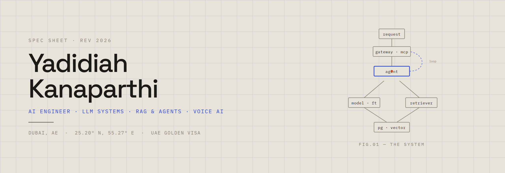

<picture>
  <source media="(prefers-color-scheme: dark)" srcset="./assets/banner-dark.png" />
  
</picture>

<p align="center">
  <a href="https://yadidiah.vercel.app"></a>
  <a href="https://yadidiah.vercel.app/writing"></a>
  <a href="https://yadidiah.vercel.app/resume.pdf"></a>
  <a href="https://www.linkedin.com/in/yadidiah-kanaparthi/"></a>
  <a href="https://medium.com/@yadidiah.k"></a>
</p>

I build production-shaped AI and backend systems — RAG pipelines, LLM fine-tuning,
voice agents, and the FastAPI / Postgres services that hold them up. I work end to
end, with tests, migrations, and eval harnesses rather than notebooks, and I go
deep on how the models actually behave.

---

### §01 · now

- Fine-tuning **Qwen2.5-1.5B** for schema-conditioned text-to-SQL with an execution-accuracy eval harness
- Building AI automation workflows at **Humai** (Dubai) — LangGraph agent loops, a Gemma QLoRA fine-tune, a Pipecat voice agent, an MCP tool gateway
- Writing up a decoder-only **GPT built from scratch** in PyTorch

---

### §02 · selected work

| Project | | |
|---|---|---|
| **GraphRAG Hierarchical Chat** | Graph-structured retrieval over long, cross-referenced document sets | [repo](https://github.com/Yadidiah-k/graphrag-hierarchical-chat) · [spec](https://yadidiah.vercel.app/work/graphrag-hierarchical-chat) |
| **PneumoScan AI** | Explainable pneumonia detection from chest X-rays — 98.42% test accuracy, Grad-CAM overlays | [repo](https://github.com/Yadidiah-k/grad-proj) · [spec](https://yadidiah.vercel.app/work/pneumoscan-ai) |
| **YouSentimentAI** | End-to-end MLOps pipeline for YouTube comment sentiment — DVC, MLflow, staged registry | [repo](https://github.com/Yadidiah-k/Youtube-Sentiment-Analysis) · [spec](https://yadidiah.vercel.app/work/yousentiment-ai) |
| **LexiQE AI** | Private, on-device legal-document Q&A — RAG over FAISS + FLAN-T5, cited answers | [repo](https://github.com/Yadidiah-k/LLM-Projects) · [spec](https://yadidiah.vercel.app/work/lexiqe-ai) |
| **Decoder-only GPT, from scratch** | Transformer, tokenizer, and training loop in raw PyTorch — to learn the internals | [notes](https://yadidiah.vercel.app/notes/transformer-forward-pass) |
| **Premium Business Planner** | AI-assisted investor-ready plans — Gemini for prose, deterministic Python for the numbers | [repo](https://github.com/Yadidiah-k/LLM-Projects) · [spec](https://yadidiah.vercel.app/work/business-planner-ai) |

Full case studies — problem, approach, outcome — at **[yadidiah.vercel.app/#work](https://yadidiah.vercel.app/#work)**

---

### §03 · stack

```
llm / genai   RAG (FAISS · pgvector · Pinecone) · LoRA / QLoRA (Unsloth)
              LangChain · LangGraph · DSPy · prompt contracts + eval harnesses
              Hugging Face · Ollama · PyTorch (from-scratch transformers)

backend       Python · FastAPI · PostgreSQL · SQLAlchemy · Alembic · Redis / RQ
              outbox pattern · idempotency keys · structured logging
              NestJS · TypeScript

ml / data     TensorFlow · Keras · scikit-learn · XGBoost · LightGBM
              MLflow · DVC · Pandas · NumPy · Apache Spark

voice ai      LiveKit · Pipecat · Deepgram · Whisper · Silero VAD · dual-STT validation

cloud / ops   GCP (Cloud Run · GKE · Vertex AI) · AWS (SageMaker · Lambda)
              Docker · Kubernetes · GitHub Actions
```

---

### §04 · writing &amp; notes

On-site notes on how LLMs, transformers, and retrieval actually behave — written
from first principles, corrected against implementation:

- [Deep learning, stated precisely](https://yadidiah.vercel.app/notes/deep-learning-precisely)
- [The transformer forward pass, token by token](https://yadidiah.vercel.app/notes/transformer-forward-pass)
- [What actually happens at inference](https://yadidiah.vercel.app/notes/inference-kv-cache-and-context) — generation loop, KV cache, GQA/MQA, serving
- [Building RAG from the boundaries in](https://yadidiah.vercel.app/notes/rag-from-the-boundaries-in)
- [Backend patterns for AI work](https://yadidiah.vercel.app/notes/backend-patterns-for-ai) — durable jobs, outbox, idempotency

Longer posts on Medium → **[@yadidiah.k](https://medium.com/@yadidiah.k)**

---

### §05 · research

Three peer-reviewed papers (IEEE · Springer, 2023–2025) on machine learning for
IoT security — threat detection, intrusion detection, and systematized log
analysis. Undergraduate thesis: implemented and benchmarked five volumetric
segmentation architectures (U-Net, V-Net, SA-Net, E1D3, HDC) on 3D MRI
brain-tumor data.

Full citations on [LinkedIn](https://www.linkedin.com/in/yadidiah-kanaparthi/).

---

### §06 · elsewhere

[LinkedIn](https://www.linkedin.com/in/yadidiah-kanaparthi/) ·
[Medium](https://medium.com/@yadidiah.k) ·
[Kaggle](https://www.kaggle.com/yadidiahk) ·
[HackerRank](https://www.hackerrank.com/profile/yadidiah) ·
[LeetCode](https://leetcode.com/u/Yadidiah-k/) ·
[Stack Overflow](https://stackoverflow.com/users/19885683/yadidiah) ·
`yadidiah.wrk@gmail.com`

---

<p align="center">
  
  &nbsp;
  
</p>
